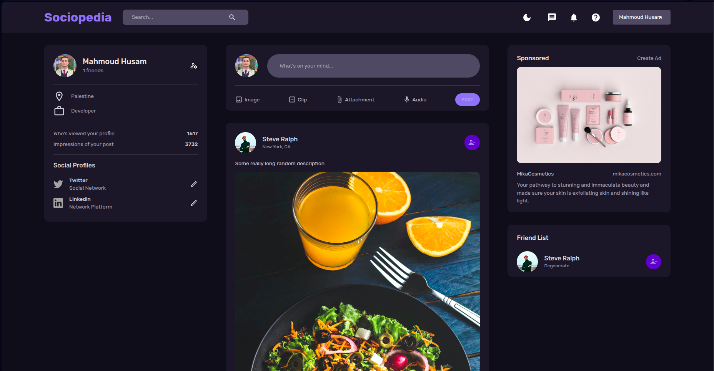

# Social Media MERN App

[](https://nodejs.org/) [](https://www.mongodb.com/) [](https://reactjs.org/) [](https://expressjs.com/)

A full‑stack social media platform built with the MERN stack, featuring secure authentication, user profiles, posts, and interactive UI.

## 📸 Demo

<p align="center">
  
</p>

## ✨ Key Features

- 🔒 **Authentication**: Sign up, log in, and secure routes using JWTs
- 🏞️ **User Profiles**: Create, update, and view profiles
- ✍️ **Posts & Comments**: CRUD operations for posts and comments
- ❤️ **Reactions**: Like and unlike posts in real time
- 🌐 **Real-time Updates**: WebSocket-powered live feed refresh
- 📱 **Responsive Design**: Works seamlessly on mobile and desktop

## 🏗️ Project Structure

```
root
├─ server/        # Express API with MongoDB
├─ client/        # React frontend
└─ images/        # Screenshots and assets
```

### Backend (`server`)

- **Node.js & Express**: RESTful API framework
- **MongoDB & Mongoose**: Data storage and schema validation
- **JWT Authentication**: Secure login and protected routes

### Frontend (`client`)

- **React**: Modern component-based UI
- **Redux Toolkit**: Global state management
- **Material UI**: Pre-built design components
- **React Router**: Client-side routing

## 🚀 Quick Start

### Prerequisites

- Node.js (v18+), npm or yarn
- MongoDB (local or cloud)

### Setup & Run

```bash
# Clone repository
git clone https://github.com/mahmoudhusam/social-media-mern-app.git
cd social-media-mern-app

# Install dependencies
cd server && npm install && cd ../client && npm install

# Start servers in parallel
# Terminal 1 - backend:
cd server && npm start

# Terminal 2 - frontend:
cd client && npm start
```

## ⚙️ Environment Variables

### Server

Create `server/.env` with:

```bash
MONGO_URI=<your MongoDB URI>
PORT=<server port, e.g., 3001>
JWT_SECRET=<your JWT secret>
```

## 🛠️ Technologies Used

- **Backend**: Node.js, Express, MongoDB, Mongoose, JWT
- **Frontend**: React, Redux Toolkit, Material UI, React Router

---
